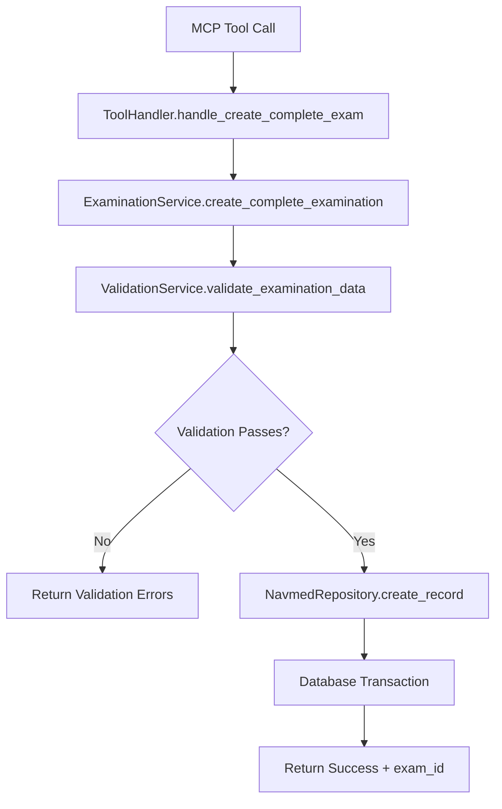
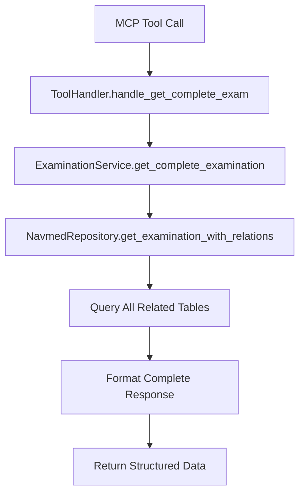
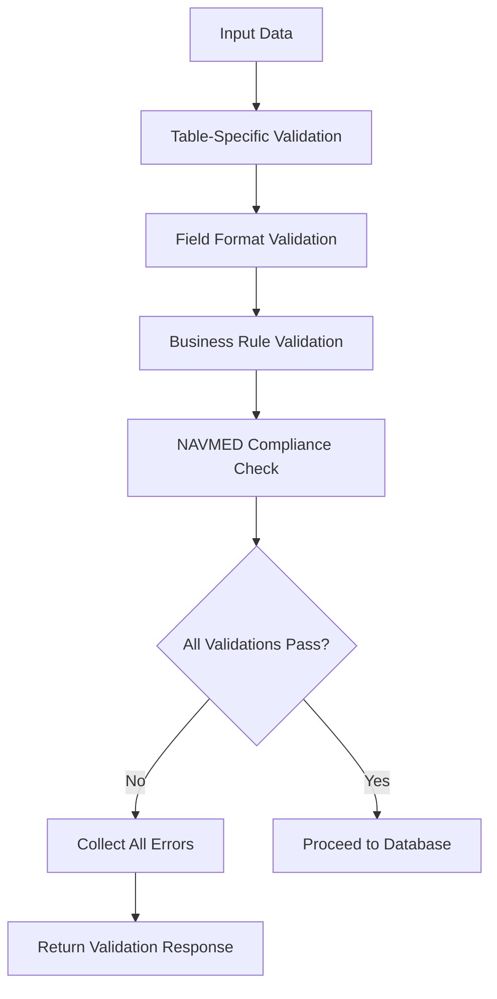

# NAVMED System Architecture Overview

## 🏗️ High-Level Architecture

The NAVMED 6470/13 Radiation Medical Examination System follows a clean, layered architecture designed for maintainability, testability, and compliance with medical standards.

```
┌─────────────────────────────────────────────────────────────┐
│                    MCP Client (AI/User)                    │
└─────────────────────┬───────────────────────────────────────┘
                      │ MCP Protocol
┌─────────────────────▼───────────────────────────────────────┐
│                   MCP Server Layer                         │
│  ┌─────────────────┬─────────────────┬───────────────────┐  │
│  │   Resources     │     Prompts     │      Tools        │  │
│  │   Handler       │    Handler      │     Handler       │  │
│  └─────────────────┴─────────────────┴───────────────────┘  │
└─────────────────────┬───────────────────────────────────────┘
                      │
┌─────────────────────▼───────────────────────────────────────┐
│                 Business Services Layer                    │
│  ┌─────────────────┬─────────────────┬───────────────────┐  │
│  │  Examination    │   Validation    │    Reporting      │  │
│  │   Service       │    Service      │     Service       │  │
│  └─────────────────┴─────────────────┴───────────────────┘  │
└─────────────────────┬───────────────────────────────────────┘
                      │
┌─────────────────────▼───────────────────────────────────────┐
│                 Data Access Layer                          │
│  ┌─────────────────┬─────────────────┬───────────────────┐  │
│  │    NAVMED       │     Schema      │   Database        │  │
│  │  Repository     │    Manager      │ Initialization    │  │
│  └─────────────────┴─────────────────┴───────────────────┘  │
└─────────────────────┬───────────────────────────────────────┘
                      │
┌─────────────────────▼───────────────────────────────────────┐
│                   Data Storage                             │
│           SQLite Database + PDF Documents                  │
└─────────────────────────────────────────────────────────────┘
```

## 🎯 Core Design Principles

### **1. Separation of Concerns**
- **MCP Layer** - Protocol handling only
- **Service Layer** - Business logic and validation
- **Data Layer** - Database operations and schema management
- **Handler Layer** - Request routing and formatting

### **2. Repository Pattern**
- **Clean abstraction** over database operations
- **Testable** through interface mocking
- **Swappable** for different database backends
- **Consistent** error handling and logging

### **3. Validation-First Architecture**
- **Business rules** enforced at service layer
- **NAVMED compliance** built into validation engine
- **Input validation** before database operations
- **Rich error messages** for compliance failures

### **4. Handler Delegation**
- **Tool handlers** manage MCP tool operations
- **Resource handlers** manage PDF and note access
- **Prompt handlers** generate contextual prompts
- **Clean routing** in main server

## 📦 Component Architecture

### **MCP Server Layer** (`server_refactored.py`)

```python
@server.list_tools()    # Tool discovery
@server.call_tool()     # Tool execution
@server.list_resources() # Resource discovery
@server.read_resource()  # Resource access
@server.list_prompts()   # Prompt discovery
@server.get_prompt()     # Prompt generation
```

**Responsibilities:**
- MCP protocol compliance
- Request routing to handlers
- Response formatting
- Error propagation

### **Handler Layer** (`handlers/`)

#### **ToolHandlers** (`tool_handlers.py`)
- Database operations (CRUD)
- Examination management
- Data validation coordination
- Search functionality

#### **ResourceHandlers** (`resource_handlers.py`)
- PDF document access
- Note management
- URI scheme handling
- Content extraction

#### **PromptHandlers** (`prompt_handlers.py`)
- Medical procedure explanations
- Examination templates
- Review prompts
- Context-aware generation

### **Service Layer** (`services/`)

#### **ExaminationService** (`examination_service.py`)
- High-level examination operations
- Coordinate repository and validation
- Business workflow management
- Complex query operations

#### **ValidationService** (`validation_service.py`)
- NAVMED 6470/13 compliance rules
- Field validation (SSN, dates, etc.)
- Business rule enforcement
- Medical standards compliance

### **Data Access Layer** (`database/`)

#### **NavmedRepository** (`navmed_repository.py`)
- Clean database abstraction
- CRUD operations
- Query building
- Transaction management

#### **Database Initialization** (`init_database.py`)
- Schema creation
- Sample data loading
- Database verification
- Migration support

## 🗄️ Database Design

### **NAVMED 6470/13 Compliance**

The database schema directly maps to NAVMED 6470/13 form structure:

```sql
-- Header Information
examinations (exam_id, exam_type, patient_info, facility_id)

-- Medical History (Blocks 3-10)
medical_history (history_id, exam_id, cancer_history, radiation_therapy, ...)

-- Laboratory Findings (Block 11)
laboratory_findings (lab_id, exam_id, hematocrit, wbc_count, differential_*)

-- Urine Testing (Block 12)
urine_tests (urine_id, exam_id, dipstick_blood_result, microscopic_*)

-- Additional Studies (Block 13)
additional_studies (study_id, exam_id, study_type, results, ...)

-- Abnormal Findings (Block 14)
abnormal_findings (finding_id, exam_id, description, category, ...)

-- Physical Examination (Blocks 15-19)
physical_examination (physical_id, exam_id, thyroid_status, breast_status, ...)

-- Assessment (Blocks 20a, 20b)
assessments (assessment_id, exam_id, initial_assessment, final_determination, ...)

-- Certifications (Blocks 21-23)
certifications (cert_id, exam_id, physician_signatures, dates, ...)

-- Supporting Tables
examining_facilities (facility_id, name, address, type)
```

### **Referential Integrity**

```sql
-- Foreign Key Constraints
FOREIGN KEY (facility_id) REFERENCES examining_facilities (facility_id)
FOREIGN KEY (exam_id) REFERENCES examinations (exam_id)

-- Cascading Rules
ON DELETE CASCADE  -- Remove related records when exam deleted
ON UPDATE CASCADE  -- Update references when IDs change
```

### **Data Validation Constraints**

```sql
-- Exam Type Validation
CHECK (exam_type IN ('PE', 'RE', 'SE', 'TE'))

-- Status Validation
CHECK (thyroid_status IN ('NML', 'ABN', 'NE'))

-- Assessment Validation
CHECK (initial_assessment IN ('PQ', 'NPQ'))

-- Urine Results Validation
CHECK (dipstick_blood_result IN ('Negative', 'Positive', 'Not Performed'))
```

## 🔄 Data Flow Patterns

### **Complete Examination Creation**



### **Examination Retrieval**



### **Data Validation Flow**



## 🛡️ Error Handling Strategy

### **Layered Error Handling**

1. **Input Validation** - Format and type checking
2. **Business Validation** - NAVMED compliance rules
3. **Database Constraints** - SQL-level validation
4. **Exception Handling** - Graceful failure management

### **Error Context Preservation**

```python
try:
    result = self.repository.create_record(table_name, data)
except Exception as e:
    logger.error(f"Error creating record in {table_name}: {e}")
    return {"success": False, "error": str(e), "context": {"table": table_name, "data": data}}
```

### **User-Friendly Error Messages**

- **Validation Errors** - Specific field and rule violations
- **Database Errors** - Simplified technical error explanations
- **System Errors** - Actionable guidance for resolution

## 🔍 Logging and Monitoring

### **Structured Logging**

```python
logger.info(f"Created record in {table_name} with ID {result['inserted_id']}")
logger.warning(f"Failed to create {section}: {section_result}")
logger.error(f"Database error executing query: {e}")
logger.debug(f"Executing query: {query}")
```

### **Audit Trail**

- **Examination Creation** - Full audit of new examinations
- **Data Modifications** - Track changes to medical records
- **Validation Failures** - Log compliance violations
- **System Access** - Monitor MCP tool usage

## 🚀 Scalability Considerations

### **Database Performance**

- **Indexed Queries** - Primary and foreign key optimization
- **Connection Pooling** - Efficient database connections
- **Query Optimization** - Minimize complex joins
- **Batch Operations** - Efficient bulk data processing

### **Memory Management**

- **Lazy Loading** - Load related data on demand
- **Result Pagination** - Limit large query results
- **Resource Cleanup** - Proper connection closure
- **Cache Strategy** - Cache frequently accessed data

### **Extension Points**

- **Plugin Architecture** - Additional validation rules
- **Database Abstraction** - Support multiple database backends
- **Service Interfaces** - Clean extension points
- **Configuration Management** - Environment-specific settings

---

**See Also:**
- [`memory/components/server_architecture.md`](../components/server_architecture.md) - Server implementation details
- [`memory/components/database_layer.md`](../components/database_layer.md) - Database design patterns
- [`memory/workflows/examination_workflow.md`](../workflows/examination_workflow.md) - End-to-end processes 